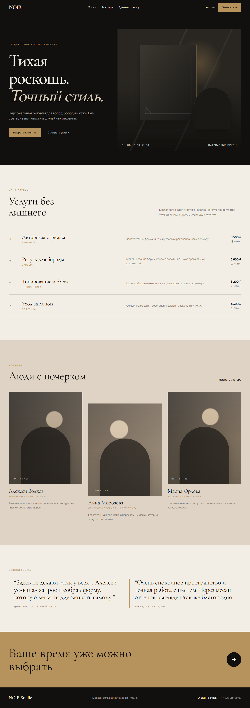
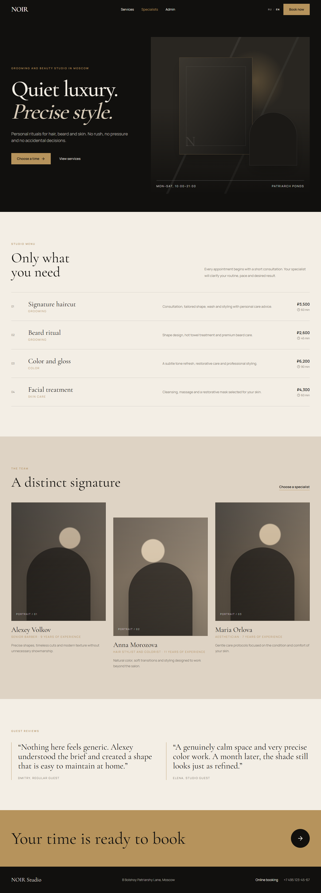

# NOIR Studio Booking


NOIR Studio Booking is a bilingual service-booking case study for a premium barbershop and beauty studio. It implements a complete mock booking journey with service/master compatibility, date and time rules, validation, and a lightweight administration view.

## Live Demo

https://booking-service-app-lyart.vercel.app

## Source Code

https://github.com/Andrey15211/booking-service-app

## Features

- Six-step booking flow from service selection to confirmation
- Service and specialist compatibility filtering
- Working-hours slot generation with duration and overlap checks
- Past and occupied time exclusion
- Validated customer details
- Admin view with date/master filters and editable mock statuses
- Mock mode with an optional Supabase client boundary

## Tech Stack

- Next.js App Router
- React
- TypeScript
- Tailwind CSS
- React Hook Form and Zod
- date-fns
- next-intl
- Supabase JS
- Vitest

## Localization

- RU/EN support: customer flow, admin UI, validation, dates, and prices
- Default language: Russian (`/ru`)
- Language switcher: available in the site header
- Localized booking and admin routes preserve the current page

## Screenshots

### Desktop



### Mobile

Planned path: `docs/screenshots/mobile.png`

### RU/EN example



Mobile screenshot will be added after final device-width capture.

## Local Development

```bash
npm install
npm run dev
npm run build
```

The demo runs without environment variables. Optional Supabase variables are documented in `.env.example`.

## Deployment

Deployed on Vercel using the Next.js preset. Without Supabase variables, the application remains in mock mode and admin changes reset on refresh.

## What this project demonstrates

- Booking logic and interval-overlap rules
- Fullstack-like data boundaries
- Multi-step transactional UX
- Schema-validated forms
- Localized commercial frontend development

## Recommended GitHub Topics

`booking-system` `appointment-booking` `nextjs` `typescript` `react-hook-form` `zod` `date-fns` `next-intl` `supabase` `vercel`
